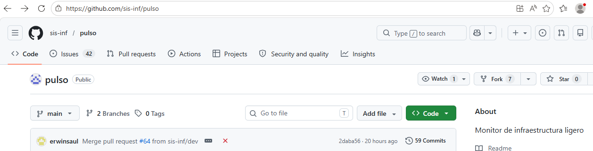
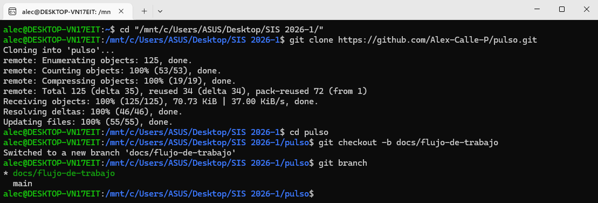
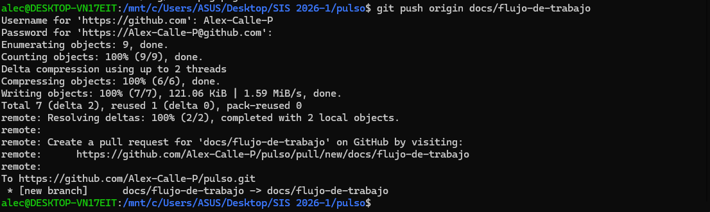
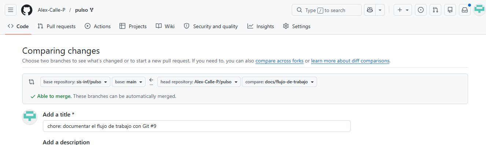

# Guía Paso a Paso: Forking Workflow

Este documento describe las tecnicas y primeros pasos para el proycto.

## 1. Cómo hacer Fork
Para iniciar se debe realizar un Fork del repositorio principal a la cuenta personal. Esto crea una copia exacta para trabajar sin afectar el proyecto original.


## 2. Como crear una rama
Es fundamental trabajar en ramas descriptivas. Usamos el comando `git checkout -b nombre-rama` para crearla y movernos a ella.


## 3. Cómo hacer Commit y Push
Una vez realizados los cambios se guardan con un commit descriptivo y se suben a GitHub con el comando push.


## 4. Cómo abrir un Pull Request
Finalmente en GitHub se solicita la integración de los cambios mediante un Pull Request hacia la rama `dev` del proyecto principal.



# Flujo de trabajo para contribuir al proyecto

Este documento explica el proceso completo para contribuir al proyecto **Pulso** usando el flujo de trabajo de *fork* y solicitudes de extracción.

---

## Flujo completo 

### 1. Crear tu copia del repositorio (Fork)
1. Ve al repositorio original: `https://github.com/sis-inf/pulso`
2. Haz clic en el botón **Fork** en la esquina superior derecha
3. Se creará una copia del repositorio en tu cuenta personal

### 2. Clonar tu repositorio a tu computadora
Abre la terminal y ejecuta (cambia `TU_USUARIO` por tu nombre de usuario de GitHub):
```bash
git clone https://github.com/TU_USUARIO/pulso.git
cd pulso
```
###3. Conectar con el repositorio original 
Para mantener tu copia actualizada:
```bash
git remote add upstream https://github.com/sis-inf/pulso.git
git remote -v
```
4. Crear una rama nueva para tus cambios
Siempre trabaja en una rama separada, nunca en  dev  o  main :
```bash
git checkout dev
git pull upstream dev
git checkout -b fix-docs/flujo-completo
```
###5. Compilar el proyecto con CMake
Verifica que todo funcione correctamente antes de modificar:
```bash
cmake -B build
cmake --build build
```
###6. Desarrollar y aplicar formato
- Realiza tus cambios en el código
- Formatea el código automáticamente con  clang-format :
```bash
clang-format -i src/*.cpp src/*.h tests/*.cpp
```
- Verifica pruebas con  ctest :
```bash
cd build
ctest -V
cd ..
```
- Usa pre-commit para revisiones automáticas antes de guardar:
```bash
pre-commit run --all-files
```
###7. Guardar tus cambios
```bash
git add .
git commit -m "fix(docs): completar flujo de trabajo con comandos exactos #375"
```
###8. Subir tus cambios a tu repositorio
```bash
git push origin fix-docs/flujo-completo
```
9. Crear la solicitud de extracción (Pull Request)
    1. Entra a tu repositorio en GitHub
    2. Verás el aviso: Compare & pull request → haz clic
    3. Configura:
        - Base:  sis-inf/pulso  →  dev 
        - Comparar:  TU_USUARIO/pulso  → tu rama
    4. Completa la descripción y envía
